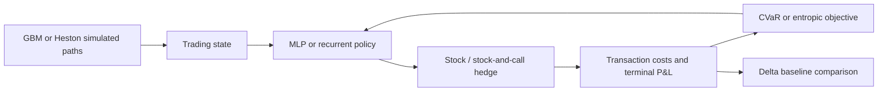

# Deep Hedging

**Learning hedging policies when transaction costs and trading constraints matter.**

A team research implementation and interactive Streamlit presentation inspired by the Deep Hedging framework. The application compares neural trading policies with classical delta hedging on simulated market paths, then explores the resulting profit-and-loss distributions and downside risk.

## Model workflow



## What you can explore

- Stock-only MLP and recurrent stock-plus-call hedging policies.
- Geometric Brownian Motion and Heston market simulations.
- Black–Scholes delta hedging as a classical reference.
- Risk-sensitive objectives, transaction costs, strategy replay, and stress scenarios.
- Streamlit views for results, trader summaries, replay, stress tests, and the gamma frontier.

## Technology

Python · PyTorch · Streamlit · NumPy · Pandas · Matplotlib.

## Run the presentation

```sh
pip install streamlit torch numpy pandas matplotlib
streamlit run app_final1.py
```

Use an isolated Python environment. Training time depends on the simulation and model settings selected in the app.

## Repository guide

| File | Purpose |
| --- | --- |
| [`app_final1.py`](app_final1.py) | Models, simulations, objectives, and interactive application |
| [`ppt final.pptx`](ppt%20final.pptx) | Team presentation |

## Research context

Based on [Deep Hedging](https://arxiv.org/abs/1802.03042) by Buehler and colleagues. This repository is a student implementation and presentation, separate from the original authors’ code and published validation. Results use simulated price paths and depend on model and market assumptions; they are not evidence of live trading performance.

Team work by Likhith Nagaralu Gurumurthy, Manvith Reddy Dalli, and Sneh Patel.
